# Offline Reinforcement Learning: SAC+BC, IQL, and FQL

Implementation of three offline RL algorithms: SAC+BC, IQL, and FQL for continuous control on simulated robotic tasks from the [OGBench](https://github.com/seohongpark/ogbench) suite. Evaluated on cube manipulation and ant soccer navigation tasks.

---

## Overview

Offline RL learns policies entirely from static datasets, without any environment interaction. This poses a key challenge: *distributional shift*, where the learned policy may query the Q-function on out-of-distribution (OOD) actions not covered by the dataset, leading to overestimated values and unstable training.

The three algorithms explored here tackle this with different strategies:

| Algorithm | Policy Class | OOD Mitigation Strategy | Best α (cube) | Best α (antsoccer) |
|-----------|-------------|--------------------------|--------------|-------------------|
| SAC+BC | Gaussian | Explicit BC loss term on actor | 100 | 10 |
| IQL | Gaussian | Expectile regression + advantage-weighted BC | 1 | 10 |
| FQL | Flow (expressive) | One-step policy distillation from behavioural flow | 100 | 10 |

---

## Part 1: SAC+BC - behavioural Regularization

SAC+BC augments the standard SAC actor loss with a behavioural cloning (BC) term that penalizes deviation from dataset actions.

### Actor Loss

$$\mathcal{L}(\pi) = \mathbb{E}\left[ -\frac{1}{2}\sum_{i=1}^{2} Q_i(s, a^\pi) + \alpha \cdot \frac{1}{|A|}\|a - a^\pi\|_2^2 + \beta \cdot \log \pi(a^\pi|s) \right]$$

The first term maximizes Q-values; the second is the BC regularizer; the third maximizes policy entropy. The coefficient α controls the strength of behavioural regularization and is the key hyperparameter to tune.

### Bellman Backup

$$y = r + \frac{\gamma}{2}\sum_{j=1}^{2} \bar{Q}_j(s', a')$$

The **average** of the two target Q-values is used, and the **entropy** is omitted from the backup.

### Results

**cube-single α sweep:**

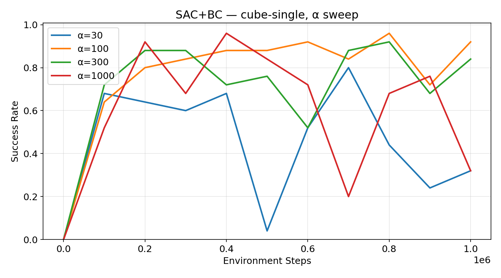

α=100 and α=300 are clearly superior, both reaching ~88–92% by 200K steps. α=30 learns initially but degrades badly after 400K due to insufficient behavioural regularization which causes the policy to drift OOD. α=1000 learns quickly early but remains volatile throughout. **Best: α=100** (final ~92%).

**Policy MSE sanity check:**

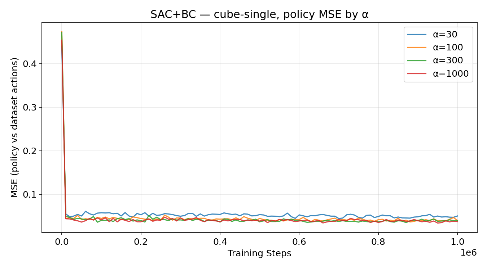

All runs converge rapidly from the initial spike (~0.47) to a stable ~0.04–0.06. Higher α produces marginally lower MSE (the policy stays closer to dataset actions), confirming the BC term is functioning as intended.

**Q-value bounds:**

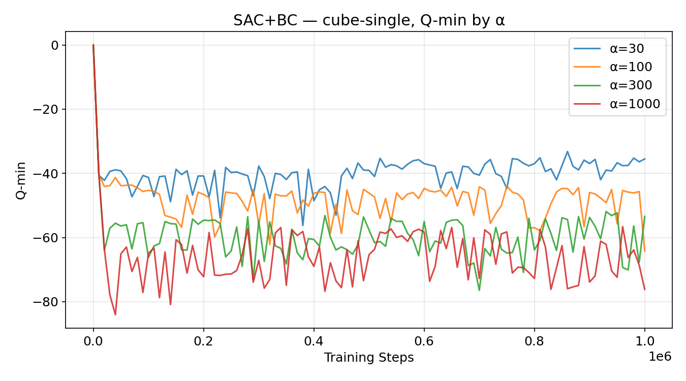

Q-min stratifies cleanly by α: α=30 converges to ~−38, α=100 to ~−45, α=300 to ~−55, and α=1000 to ~−65. All fall in the expected range of −50 to −70 for cube-single (a short-horizon task). Q-max hovers near 0 for all runs, consistent with the sparse 0/−1 reward structure.

**antsoccer-arena α sweep:**

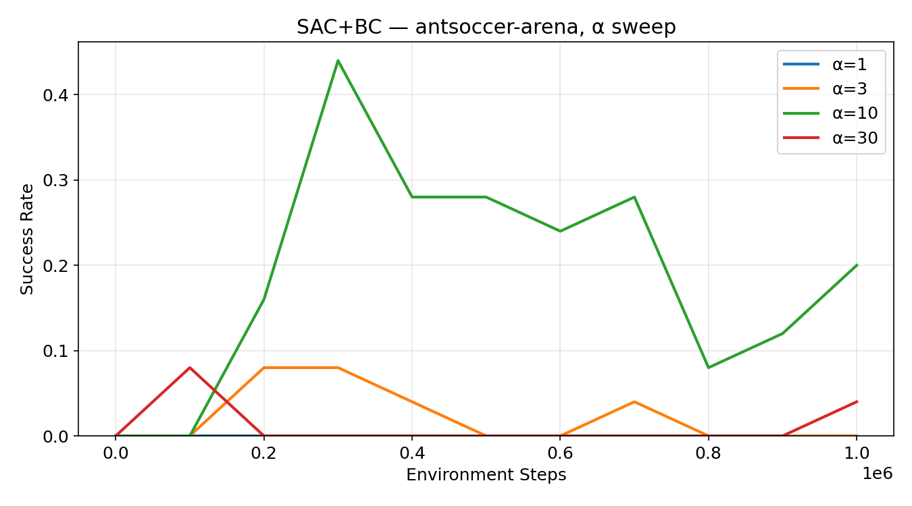

α=10 dominates, peaking at ~44% around 300K steps before degrading to ~20% at 1M. α=3 and α=30 plateau below 10%; α=1 effectively fails. The task demands a stronger RL signal than cube-single — too little α (1, 3) underperforms and too much (30) over-regularizes. **Best: α=10** (peak ~44%).

### Summary

| Task | Best α | Peak Success Rate | Final Success Rate |
|------|--------|------------------|--------------------|
| cube-single | 100 | ~96% | ~92% |
| antsoccer-arena | 10 | ~44% | ~20% |

---

## Part 2: IQL - Implicit Q-Learning

IQL avoids OOD action queries entirely by using **expectile regression** on a separate value function V(s) to implicitly approximate the Bellman max without querying Q on unseen actions. The policy is then extracted via **advantage-weighted regression** which is a form of weighted behavioural cloning.

### Value Loss (Expectile Regression)

$$\mathcal{L}(V) = \mathbb{E}_{(s,a)\sim D}\left[ \ell_2^\tau\left(V(s) - \min_{i=1,2} \bar{Q}_i(s,a)\right) \right]$$

where $\ell_2^\tau(x) = |\tau - \mathbf{1}(x > 0)| \cdot x^2$. We use τ = 0.9 throughout.

### Policy Loss (Advantage-Weighted Regression)

$$\mathcal{L}(\pi) = \mathbb{E}_{(s,a)\sim D}\left[ -\min\left(e^{\alpha A(s,a)}, M\right) \log \pi(a|s) \right]$$

where $A(s,a) = \min_i Q_i(s,a) - V(s)$ and weights are clipped at M = 100 for stability.

### Results

**cube-single α sweep:**

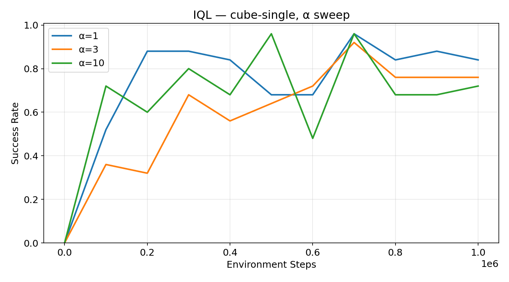

α=1 is the most stable, converging to ~88% by 200K and maintaining it steadily throughout. α=3 and α=10 also reach high success rates but are considerably more volatile as both show large dips mid-training. The lower inverse temperature of α=1 produces softer advantage weighting and more consistent behaviour. **Best: α=1** (final ~84%).

**Policy MSE:**

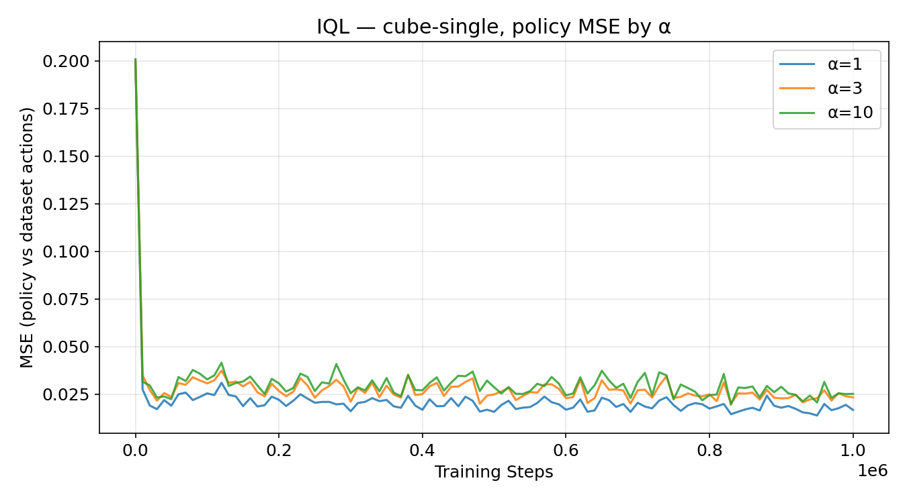

IQL's MSE is notably lower than SAC+BC's across all α values (~0.015–0.035 vs. ~0.04–0.06). This reflects IQL's advantage-weighted regression keeping the policy close to high-advantage dataset actions, rather than the full behavioural distribution.

**antsoccer-arena α sweep:**

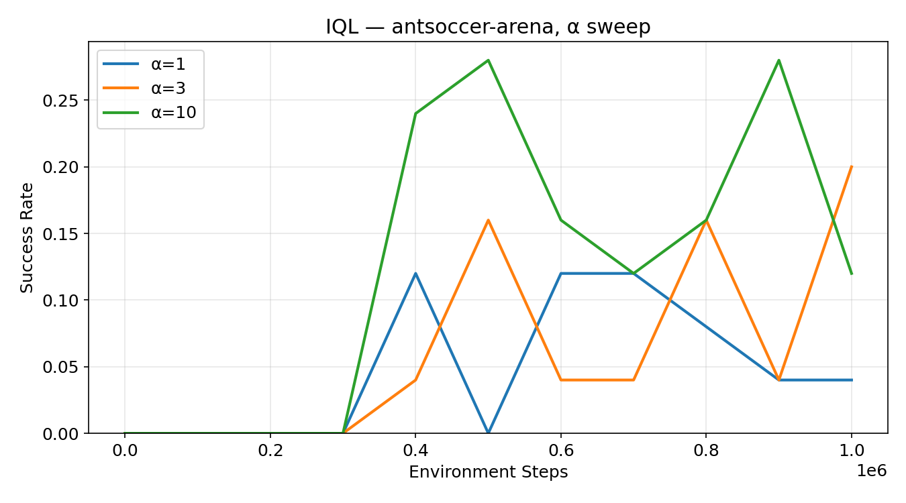

α=10 performs best, peaking at ~28% around 400K and 800K steps. All three α values are noisy, but α=10 > α=3 > α=1 consistently. **Best: α=10** (peak ~28%).

### Summary

| Task | Best α | Peak Success Rate | Final Success Rate |
|------|--------|------------------|--------------------|
| cube-single | 1 | ~96% | ~84% |
| antsoccer-arena | 10 | ~28% | ~12% |

### SAC+BC vs. IQL

**Best performance:** Both peak near ~96% on cube-single, but SAC+BC at α=100 is more stable in the second half of training, while IQL at α=1 converges faster but oscillates. On antsoccer-arena, SAC+BC (α=10) achieves a higher peak (~44% vs. ~28%) but both algorithms decay significantly by 1M steps.

**Sensitivity to α:** IQL is meaningfully more robust. All three IQL α values produce above-60% success rates on cube-single, whereas SAC+BC's α=30 collapses after 400K. The advantage-weighted regression in IQL's policy loss prevents the catastrophic Q-exploitation that occurs in SAC+BC when α is too small.

---

## Part 3: FQL - Flow Q-Learning with Expressive Policies

FQL uses an expressive **flow policy** (an ODE-based generative model) for behavioural cloning, but decouples it from Q-maximization via an auxiliary **one-step policy** to avoid backpropagation through time (BPTT).

### Key Losses

**Behavioural flow policy** (pure BC via flow matching):

$$\mathcal{L}(v) = \mathbb{E}\left[ \frac{1}{|A|}\|v(s, \tilde{a}, t) - (a - z)\|_2^2 \right], \quad \tilde{a} = (1-t)z + ta$$

**One-step policy** (Q-maximization + distillation from flow, no BPTT):

$$\mathcal{L}(\pi_\omega) = \mathbb{E}\left[ -\frac{1}{2}\sum_{i=1}^{2} Q_i(s, \pi_\omega(s,z)) + \frac{\alpha}{|A|}\|\pi_\omega(s,z) - \pi_v(s,z)\|_2^2 \right]$$

Both the Bellman backup and evaluation use π_ω.

### Results

**cube-single α sweep:**

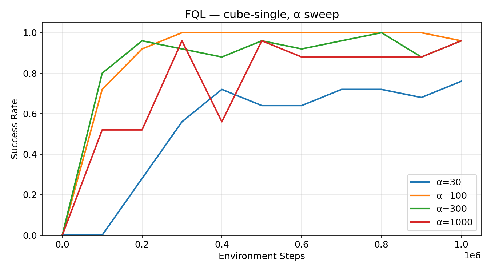

α=100 is the clear winner as it reaches 1.0 success rate by ~200K steps and holds it nearly perfectly for the rest of training. α=300 also reaches 1.0 but with more variance. α=1000 learns quickly early but becomes unstable after 300K. α=30 learns slowly, plateauing around 0.65–0.76. **Best: α=100** (final ~100%).

**antsoccer-arena α sweep:**

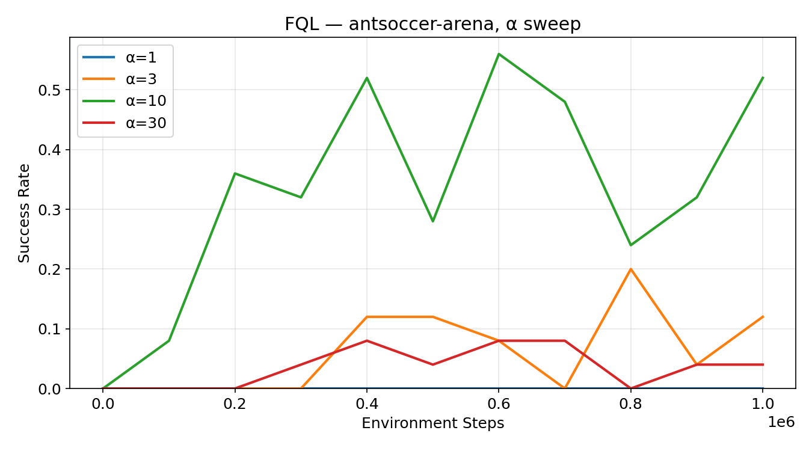

α=10 is dominant, peaking at ~56% around 600K steps and maintaining ~52% at 1M, far ahead of all other values and all other algorithms on this task. α=3 reaches ~20% sporadically; α=1 and α=30 stay below 10%. **Best: α=10** (peak ~56%).

### Summary

| Task | Best α | Peak Success Rate | Final Success Rate |
|------|--------|------------------|--------------------|
| cube-single | 100 | ~100% | ~100% |
| antsoccer-arena | 10 | ~56% | ~52% |

---

## Algorithm Comparison

**cube-single:**

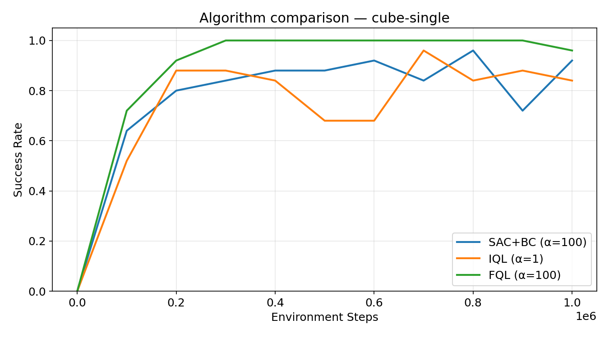

All three algorithms perform well on this task. FQL (α=100) is the most sample-efficient and stable, reaching 1.0 by ~200K and holding it. SAC+BC (α=100) reaches ~92% final with mild oscillation. IQL (α=1) converges to ~84% with more variance. The margin between algorithms is relatively small here, cube-single appears tractable for unimodal Gaussian policies, suggesting the behavioural distribution is not strongly multimodal.

**antsoccer-arena:**

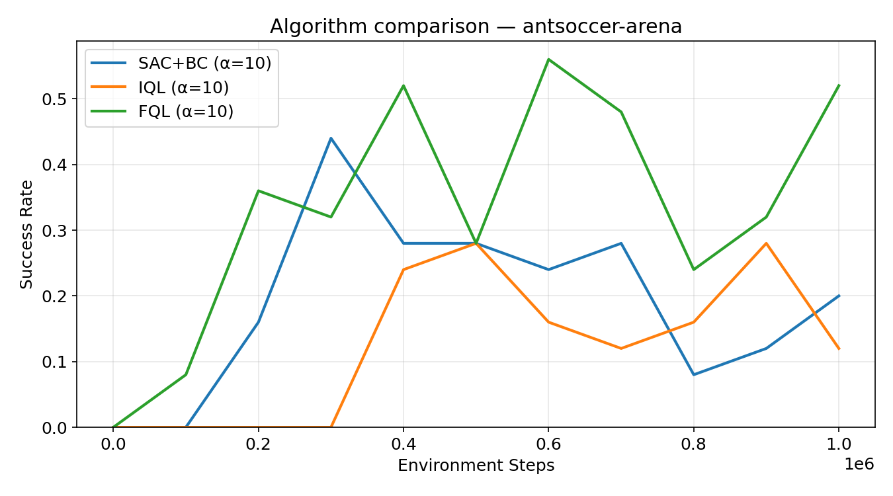

FQL's advantage is dramatic on this harder task. FQL (α=10) peaks at ~56% and ends at ~52%, while SAC+BC (α=10) peaks at ~44% but degrades to ~20% by 1M steps, and IQL (α=10) peaks at ~28% before similarly decaying. The expressive flow policy is critical here as the ant soccer task involves multimodal locomotion strategies that a unimodal Gaussian cannot fully capture.

### Overall Results

| Algorithm | cube-single (final) | antsoccer-arena (peak) | antsoccer-arena (final) |
|-----------|--------------------|-----------------------|------------------------|
| SAC+BC | ~92% | ~44% | ~20% |
| IQL | ~84% | ~28% | ~12% |
| **FQL** | **~100%** | **~56%** | **~52%** |

FQL is the best-performing algorithm across both tasks, with its advantage most pronounced on the harder antsoccer-arena task where multimodal behaviour matters. IQL is the most stable and easiest to tune. SAC+BC achieves strong peak performance but degrades on longer runs on harder tasks.

---

## Training Commands

### SAC+BC

```bash
# cube-single (best: α=100, seed=1)
uv run src/scripts/run.py --run_group=q1 --base_config=sacbc \
  --env_name=cube-single-play-singletask-task1-v0 \
  --seed=1 --alpha=100

# antsoccer-arena (best: α=10, seed=0)
uv run src/scripts/run.py --run_group=q1 --base_config=sacbc \
  --env_name=antsoccer-arena-navigate-singletask-task1-v0 \
  --seed=0 --alpha=10
```

### IQL

```bash
# cube-single (best: α=1, seed=0)
uv run src/scripts/run.py --run_group=q2 --base_config=iql \
  --env_name=cube-single-play-singletask-task1-v0 \
  --seed=0 --alpha=1

# antsoccer-arena (best: α=10, seed=0)
uv run src/scripts/run.py --run_group=q2 --base_config=iql \
  --env_name=antsoccer-arena-navigate-singletask-task1-v0 \
  --seed=0 --alpha=10
```

### FQL

```bash
# cube-single (best: α=100, seed=0)
uv run src/scripts/run.py --run_group=q3 --base_config=fql \
  --env_name=cube-single-play-singletask-task1-v0 \
  --seed=0 --alpha=100

# antsoccer-arena (best: α=10, seed=0)
uv run src/scripts/run.py --run_group=q3 --base_config=fql \
  --env_name=antsoccer-arena-navigate-singletask-task1-v0 \
  --seed=0 --alpha=10
```

